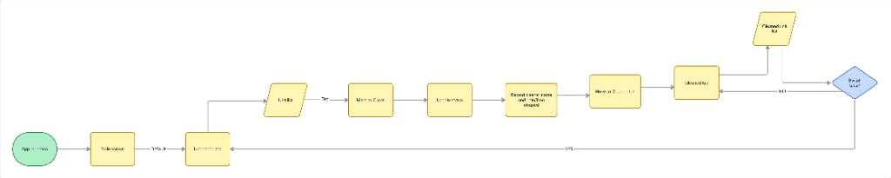
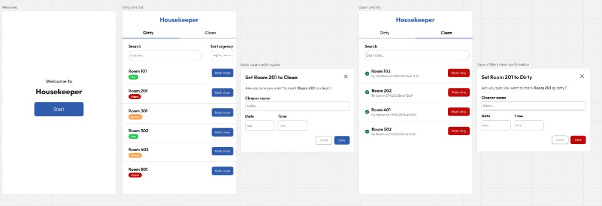

# Housekeeper App

A frontend coding challenge built with Angular 21 and Tailwind CSS.

---

## Goal

Build a housekeeping management app that allows staff to track and update the cleaning status of units. The app should support the following features:

- View **Dirty (Uncleaned)** units
- Mark units as **Clean**
- Capture cleaning details (name, date, time)
- View **Cleaned** units
- Mark units back to **Dirty**
- Search units by name
- Sort dirty units by urgency

How you structure the UI, routing, and components is entirely up to you.

## Use of AI & Tools

You’re welcome to use AI tools (e.g. ChatGPT, Copilot, Cursor) and any other resources that help you work effectively — we use AI in our day-to-day engineering work and have no issue with you doing the same.

If you do use AI, please be prepared to briefly explain your approach and decisions, and ensure you understand and can maintain the code you submit.

### App Flow



### Wireframe

Below is a simple example wireframe to give you a rough idea of the screens. You are free to design and lay out the app however you like.



---

## Getting Started

```bash
npm install
ng serve
```

The app runs at `http://localhost:4200`.

---

## Data & API

A mock backend is already set up using `angular-in-memory-web-api`. You don't need to run a separate server — all API calls are intercepted and handled in-memory.

The service at `src/app/services/unit.service.ts` provides methods to fetch and update unit data. The mock data lives in `src/app/services/in-memory-data.service.ts`.

### Endpoints

| Method | URL              | Description         |
| ------ | ---------------- | ------------------- |
| GET    | `api/units`      | Returns all units   |
| GET    | `api/units/:id`  | Returns a single unit |
| PUT    | `api/units/:id`  | Updates a unit      |

## What We’re Looking For

We’re assessing how you think and build as a senior/lead front-end engineer — not how “pretty” you can make a UI.

- **Architecture & maintainability**  
  Clear structure, sensible separation of concerns, and choices that scale (routing, feature boundaries, shared utilities, etc.).

- **State management & data flow**  
  Thoughtful handling of client state and server state, predictable updates, and minimal coupling. (If using modern Angular: signals/computed/effects where appropriate.)

- **Modern Angular practices**  
  Good use of standalone components, typed forms, reactive patterns, dependency injection, and Angular’s recommended patterns. Avoid unnecessary complexity.

- **Component design & composition**  
  Well-scoped components, reusable primitives where it makes sense, and clean inputs/outputs. Minimal prop drilling and good encapsulation.

- **Semantic HTML + accessibility**  
  Correct semantic elements (buttons/labels/forms), keyboard navigation, focus states, and accessible form validation/messages.

- **Tailwind (or styling) discipline**  
  Consistent spacing/typography patterns, responsive layout where relevant, and readable class usage (not class soup). Utility usage that supports maintainability.

- **UX correctness (not visual design)**  
  Clear flows and user feedback: loading states, disabled states, empty states, error handling, confirmation patterns, and sensible defaults.

- **Quality & engineering rigor**  
  Types are accurate, edge cases are handled, and the app feels robust. Bonus for small tests or a clear testing strategy, but not required.

- **Product thinking**  
  Sensible tradeoffs, good naming, clear intent in the UI, and implementation choices that reflect real-world usage.

Good luck!
